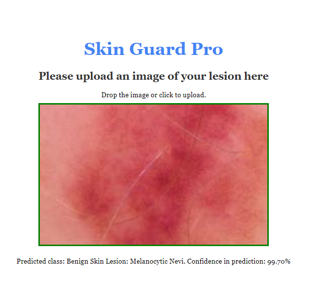

# SkinGuardAPI

SkinGuardAPI is a FastAPI-based application for skin lesion detection. Designed for preliminary skin lesion checks, it offers an intuitive drag-and-drop interface, instant predictions, and confidence scores. Aimed at dermatologists and individuals alike, this tool serves as a first step in the diagnosis process.

## Screenshot

<!-- *(Optional: If you have a screenshot of your application, replace 'path_to_screenshot.png' with its path)* -->

## Features

- **Drag-and-Drop Interface**: Easily upload images without any hassles.
- **Deep Learning Predictions**: Uses a trained deep learning model to provide accurate predictions.
- **Confidence Scores**: Understand the certainty behind each prediction.
- **Guidance System**: Offers recommendations based on the confidence score of the prediction.

## Installation & Setup

### Prerequisites

1. Docker installed on your system.
2. Git LFS installed for handling large model files.

### Steps

1. **Clone the Repository with LFS**:
    ```bash
    git lfs clone https://github.com/BlakeMoore9/SkinGuardAPI.git
    ```

2. **Build the Docker Image**:
    ```bash
    docker build -t skinguardapi .
    ```

3. **Run the Docker Container**:
    ```bash
    docker run -p 8000:8000 skinguardapi
    ```

4. **Access the Web Interface**: Open a web browser and navigate to [http://localhost:8000](http://localhost:8000).

## Handling Large Files with Git LFS

1. **Installing Git LFS**: Before cloning or working with this repository, ensure you have Git LFS installed. Use the following command to install:
    ```bash
    git lfs install
    ```

2. **Tracking New Large Files**: If you're adding new large files (like model weights) to the repository, track them with Git LFS:
    ```bash
    git lfs track "path_to_your_large_file.ext"
    ```
    Replace `path_to_your_large_file.ext` with the path to your large file. After tracking, remember to commit your `.gitattributes` file.

For more detailed instructions and troubleshooting, refer to the [official Git LFS documentation](https://git-lfs.github.com/).

## License

This project is licensed under the MIT License. For more details, see the [LICENSE](./LICENSE) file.
